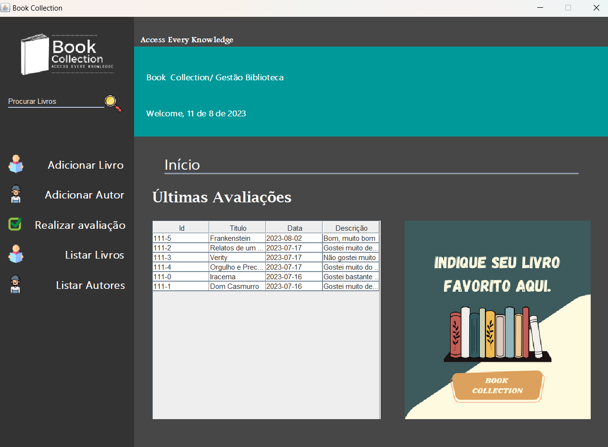
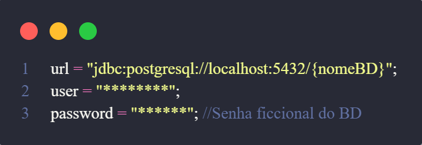

# Book Collection App - Aplicação Desktop Java com Banco de Dados Relacional

Bem-vindo ao **Book Collection**, uma aplicação desktop desenvolvida em Java com integração a um banco de dados relacional, usando o SGBD PostgreSql. Esta aplicação permite que você gerencie livros, autores, gêneros e avaliações de uma biblioteca pessoal.

## Principais Objetivos

O **Book Collection** foi criado para facilitar o gerenciamento e o registro das informações da sua biblioteca pessoal. Com esta aplicação, você pode:

- **Adicionar um Livro:** Cadastre novos livros com informações detalhadas, incluindo título, autor, gêneros e avaliações.

- **Adicionar um Autor:** Registre informações de autores, como nome e informações biográficas.

- **Adicionar Gêneros de um Livro:** Associe gêneros a cada livro para facilitar a organização.

- **Avaliar um Livro:** Deixe suas avaliações e comentários sobre os livros que você leu.

- **Listar Todos os Livros:** Visualize uma lista completa de todos os livros cadastrados na sua biblioteca.

- **Listar Todos os Autores:** Consulte uma lista de todos os autores cadastrados.

- **Listar Todas as Avaliações:** Veja todas as avaliações e comentários feitos sobre os livros.

## Requisitos do Sistema

Certifique-se de que seu sistema atende aos requisitos mínimos para executar a aplicação:

- **Sistema Operacional:** Windows, macOS ou Linux
- **Java:** JDK 8 ou superior instalado
- **Banco de Dados:** Um servidor de banco de dados relacional (por exemplo, MySQL, PostgreSQL (usado no projeto)) configurado e em execução.

## Configuração do Banco de Dados

Antes de executar a aplicação, você precisará configurar as informações do banco de dados no arquivo `Conection.java`, localizado na pasta `./src/com/Conection`.

Substitua as informações acima pelo URL, nome de usuário e senha do seu banco de dados relacional.

## Como Usar

1. **Clone o Repositório:** Clone este repositório em sua máquina.

2. **Configuração do Banco de Dados:** Configure as informações do banco de dados no arquivo `Conection.java`.

3. **Compilação e Execução:** Compile e execute a aplicação utilizando sua IDE Java favorita ou pelo terminal.

4. **Interaja com a Aplicação:** Use a interface da aplicação para adicionar livros, autores, gêneros, avaliações e para listar informações.

